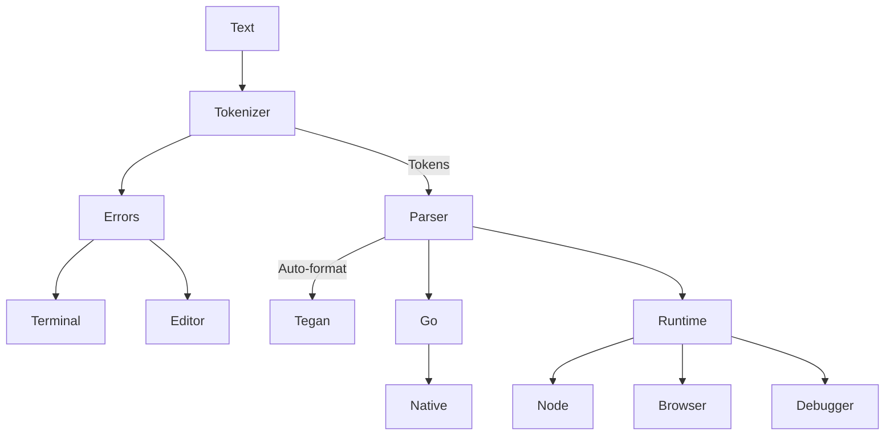

# tegan-lang

A toy language for demonstration purposes.

Tegan's a silly language which I would never use, but it sure has a great toolset.

## Diagram



## Example

```
print <-------------- % print the local stack after all the inner operations
    # 1 % add 1 to the stack
    sum % sum everything on the stack
    top
    @ top => :counter % move the top stack item to the :counter stack
    # 10 % push 10 to the stack to check if it's summed
    @ eq % consume the 10, check if the sum is 10
    @ not % if not 10, loop
    ? loop
^--------------------

print => :counter % print the :counter stack
```

Output:

```
10
0
1
2
3
4
5
6
7
8
9
10
```

## Syntax

- `"hello"` or `50` - strings and integers
- `# {integer or string}` pushes the value onto the main stack
- `print` calls the function print on the main stack
- `@ print` pops the top item off the stack, but uses it to then call print on a temporary stack composed of the popped item and the remaining stack
- `<---` defines the start of a new, local, stack which will exist until `^---`. The dashes can be as many as you want, but at least one.
- `%` starts a single line comment
- `? print` pops the top item on the stack is 0 or 1. If 1, run the given function
- `=> :somestack` denotes a named stack. `?`, function calls, and `#` all support named stacks

## Tooling

- [Playground](https://eeue56.github.io/tegan-lang/)
- Debugger (call the `debug` function)
- LSP with support for errors, file running, etc
- VSCode semantic token syntax highlighting
- Compile natively (via `go`)
- Run in the browser, server, etc
- Auto-formatter

## Run

### Run in the browser

Try out [the Playground here](https://eeue56.github.io/tegan-lang/)

### Run in interpreted mode

```
ts-node src/main.ts <filename>
```

### Start the repl

```
npm run start-repl
```

### Compile to native + run

Require Go to be installed and on the path

```
ts-node src/generators/go.ts <filename>
```

## Install the extension

```
npm run build-extension
```

Then inside `extension` there will be a `.vsix` file which you can install.